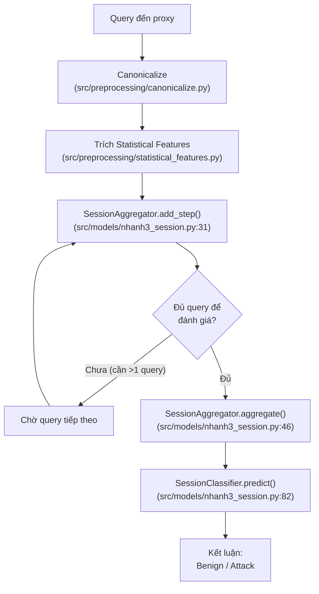
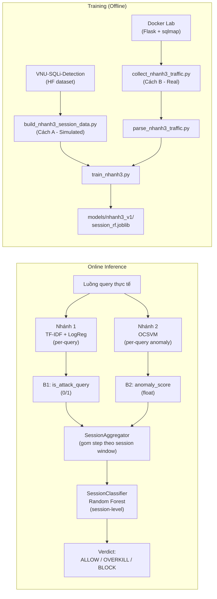
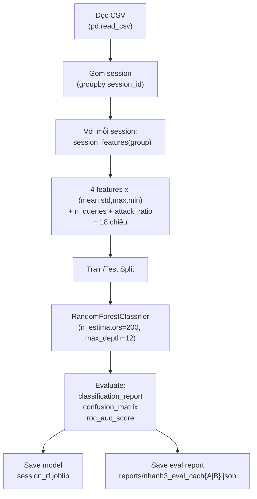
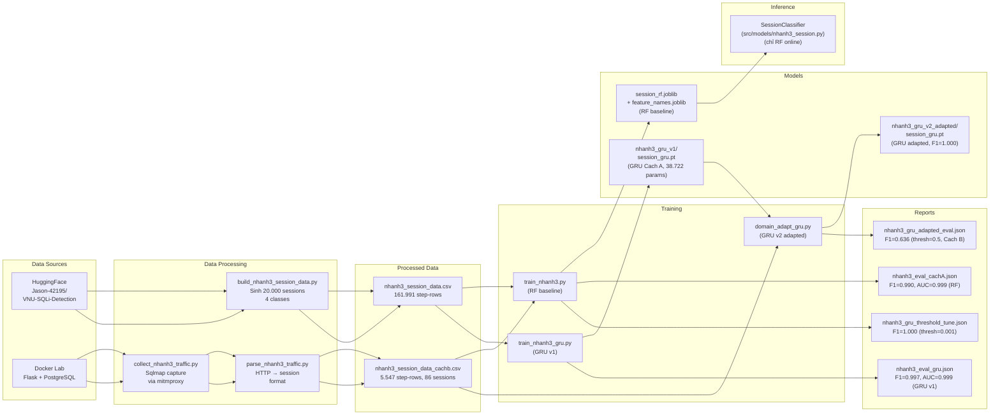
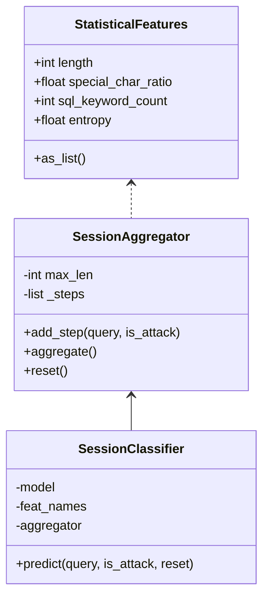

# Nhánh 3 — Session-Level SQLi Detection (Updated 20/07/2026)

> **Mục lục**
> - [Nguyên lý](#1-nguyên-lý)
> - [Kiến trúc hệ thống](#2-kiến-trúc-hệ-thống)
> - [Sample Data](#3-sample-data)
> - [Chuẩn bị dữ liệu](#4-chuẩn-bị-dữ-liệu)
> - [Training Pipeline](#5-training-pipeline)
> - [Kết quả & Phân tích](#6-kết-quả--phân-tích)
> - [Lỗ hổng & Hạn chế](#7-lỗ-hổng--hạn-chế)
> - [Code Map](#8-code-map)
> - [Data Flow](#9-data-flow)

---

## 1. Nguyên lý

### 1.1. Vấn đề

Các hệ thống phát hiện SQLi truyền thống (rule-based WAF, per-query ML classifier) đánh giá **từng câu query độc lập**. Cách này bỏ sót 2 dạng tấn công quan trọng:

1. **Blind SQLi** (boolean-based / time-based): kẻ tấn công dùng nhiều request, mỗi request chỉ hỏi 1 bit thông tin. Từng request riêng lẻ có thể trông vô hại (`id=1 AND 1=1`, `id=1 AND 1=2`).

2. **Query Splitting**: payload tấn công dài bị chia nhỏ thành nhiều request liên tiếp, mỗi request chứa một mảnh vô hại.

### 1.2. Giải pháp

**Session-level detection**: gom các query theo session (cùng client, trong khoảng thời gian ngắn), aggregate đặc trưng thống kê của toàn bộ session, và phân loại **session** (không phải từng query) là benign hay attack.

### 1.3. Luồng hoạt động



### 1.4. Input của Nhánh 3

- **Statistical features** (4 chiều): `length`, `special_char_ratio`, `sql_keyword_count`, `entropy` — giống Nhánh 2
- **`is_attack_query`**: cờ từ Nhánh 1 (TF-IDF + Logistic Regression) — cho biết query này có bị Nhánh 1 gắn cờ tấn công không
- **`n_queries`**: số lượng query trong session

### 1.5. Feature Engineering

Từ mỗi session gồm $N$ query steps, ta aggregate 4 features thống kê thành 18 chiều:

| Feature gốc | Aggregate | Số chiều |
|------------|-----------|:--------:|
| `length` | mean, std, max, min | 4 |
| `special_char_ratio` | mean, std, max, min | 4 |
| `sql_keyword_count` | mean, std, max, min | 4 |
| `entropy` | mean, std, max, min | 4 |
| `n_queries` | (giữ nguyên) | 1 |
| `attack_ratio` | mean of `is_attack_query` | 1 |
| **Tổng** | | **18** |

---

## 2. Kiến trúc hệ thống



---

## 3. Sample Data

### 3.1. Cách A — Simulated (từ HF dataset)

File: `data/processed/nhanh3_session_data.csv` (161.991 step-rows, 20.000 sessions)

| session_id | step | session_label_name | query_raw | length | attack_ratio |
|-----------:|-----:|-------------------|-----------|-------:|-------------:|
| 0 | 0 | benign | `SELECT * FROM users WHERE id = 1` | 36 | 0.0 |
| 0 | 1 | benign | `/blog/wp-content/plugins/...` | 105 | 0.0 |
| *...* | *...* | *...* | *...* | *...* | *...* |
| 42 | 0 | boolean_blind | `SELECT * FROM products WHERE id = 1` | 38 | 0.0 |
| 42 | 1 | boolean_blind | `id=1 AND (SELECT CASE WHEN (1=1) THEN 1 ELSE 0 END)=1` | 57 | 1.0 |
| 42 | 2 | boolean_blind | `id=1 AND (SELECT CASE WHEN (1=2) THEN 1 ELSE 0 END)=1` | 57 | 1.0 |
| 42 | 3 | boolean_blind | `/index.php` | 11 | 0.0 |
| *...* | *...* | *...* | *...* | *...* | *...* |
| 99 | 0 | query_splitting | `/search?q=admin` | 17 | 0.0 |
| 99 | 1 | query_splitting | `/search?q=' UNION SELECT username` | 30 | 0.0 |
| 99 | 2 | query_splitting | `/search?q=, password FROM users--` | 32 | 1.0 |

### 3.2. Cách B — Real sqlmap payloads + CSIC 2010

File: `data/processed/nhanh3_session_data_cachb.csv` (4.547 step-rows, 86 sessions)
- 36 real sessions (30 attack-by-technique + 6 benign) từ sqlmap với 120s delays
- 50 CSIC 2010 benign pseudo-sessions (len 5-15 mỗi session)

| session_id | step | query_raw | is_attack_query |
|-----------:|-----:|-----------|----------------:|
| 0 | 0 | `http://localhost:42801/user?id=1` | 0 |
| 0 | 1 | `http://localhost:42801/user?id=1&bebu=5754%20AND%201%3D1%20UNION%20ALL%20SELECT%201%2CNULL..` | 1 |
| 0 | 2 | `http://localhost:42801/user?id=1` | 0 |
| 0 | 3 | `http://localhost:42801/user?id=4407` | 0 |

### 3.3. Session-level features (sau aggregate)

| special_char_ratio_mean | length_mean | entropy_mean | n_queries | attack_ratio | session_label |
|------------------------:|-----------:|-------------:|----------:|-------------:|--------------|
| 0.042 | 82.3 | 4.12 | 6 | 0.0 | 0 (benign) |
| 0.078 | 67.5 | 4.45 | 12 | 0.58 | 1 (attack) |

---

## 4. Chuẩn bị dữ liệu

### 4.1. Cách A — Simulated Sessions

**Script**: `scripts/build_nhanh3_session_data.py`

**Input**: HuggingFace dataset `Jason-42195/VNU-SQLi-Detection` (file `nhanh1_train.csv`)

**Cách sinh**:
- Tạo pool query cho từng lớp: `normal` (label=0), `boolean_blind` (label=3), `time_blind` (label=4)
- **Benign session**: chọn ngẫu nhiên 3-15 query normal
- **Boolean blind session**: `[1-3 normal] + [5-20 boolean_blind attacks] + [0-2 normal]`
- **Time blind session**: `[1-3 normal] + [5-20 time_blind attacks] + [0-2 normal]`
- **Query splitting session**: chọn 1 attack dài (>60 ký tự), xẻ làm 3 mảnh, xen kẽ normal

**Kết quả**: 20.000 sessions (5.000 mỗi lớp), 80% train / 20% test

**Config** (`configs/config.yaml`):
```yaml
branch3_session:
  simulation:
    num_sessions_per_class: 5000
    seed: 42
    benign:
      min_len: 3      # số query tối thiểu
      max_len: 15     # số query tối đa
    blind:
      leading_normals: [1, 3]    # query lành trước
      attack_queries: [5, 20]    # query tấn công
      trailing_normals: [0, 2]   # query lành sau
    test_fraction: 0.2
```

### 4.2. Cách B — Real sqlmap Traffic

**Script**: `scripts/collect_nhanh3_traffic.py` + `scripts/parse_nhanh3_traffic.py`

**Pipeline**:
1. Start **mitmproxy** (`mitmdump`) làm proxy trung gian
2. Chạy **sqlmap** với 6 techniques (BEUSTQ) nhắm vào 5 endpoint: `/user?id=1`, `/search?q=admin`, `/product?id=1`, `/profile?uid=1`, `/order?oid=1`
3. 120s delay giữa các technique để tách session riêng biệt
4. Gửi benign requests qua proxy
5. Dừng mitmproxy, export flow file → CSV
6. Parse CSV: detect attack bằng keyword (`SELECT`, `UNION`, `SLEEP`, ...), group session bằng `idle_gap_seconds`

**Config**:
```yaml
branch3_session:
  session_idle_gap_seconds: 1800  # 30 phút không request -> session mới
```

### 4.3. Dữ liệu cần chuẩn bị

| File | Nội dung | Cách tạo |
|------|----------|----------|
| `data/processed/nhanh3_session_data.csv` | 20.000 simulated sessions | `uv run python scripts/build_nhanh3_session_data.py` |
| `data/raw/nhanh3_sqlmap_sessions/nhanh3_raw_traffic.csv` | HTTP traffic từ sqlmap | `uv run python scripts/collect_nhanh3_traffic.py` |
| `data/processed/nhanh3_session_data_cachb.csv` | 36 parsed sessions từ sqlmap | `uv run python scripts/parse_nhanh3_traffic.py` |
| `data/processed/nhanh3_session_data_cachb.csv` | 36 real + 50 CSIC | `uv run python scripts/integrate_csic2010_cachb.py` |

---

## 5. Training Pipeline

### 5.1. Script train

**File**: `scripts/train_nhanh3.py`

```bash
uv run python scripts/train_nhanh3.py          # Cách A (simulated)
uv run python scripts/train_nhanh3.py --cach B  # Cách B (sqlmap)
```

### 5.2. Các bước training



### 5.3. Parameters

```python
# scripts/train_nhanh3.py:121-124
clf = RandomForestClassifier(
    n_estimators=200,        # 200 cây
    max_depth=12,            # độ sâu tối đa
    random_state=42,         # seed từ config
    class_weight="balanced", # cân bằng lớp
    n_jobs=-1,               # dùng CPU đa luồng
)
```

### 5.4. Features đầu ra (18 chiều)

```python
# scripts/train_nhanh3.py:35-46
FEATURE_NAMES = ["length", "special_char_ratio", "sql_keyword_count", "entropy"]

def _session_features(group: pd.DataFrame) -> dict:
    feats = {}
    for f in FEATURE_NAMES:
        vals = group[f].values
        feats[f"{f}_mean"] = float(np.mean(vals))    # trung bình
        feats[f"{f}_std"]  = float(np.std(vals))      # độ lệch chuẩn
        feats[f"{f}_max"]  = float(np.max(vals))      # max
        feats[f"{f}_min"]  = float(np.min(vals))      # min
    feats["n_queries"]   = len(group)                  # số query
    feats["attack_ratio"] = float(group["is_attack_query"].mean())  # % tấn công
    return feats
```

### 5.5. Kết quả (RF baseline)

| Dataset | Sessions | F1 (weighted) | ROC AUC |
|---------|:--------:|:-------------:|:-------:|
| Cách A (simulated test) | 4.019 | **0.9897** | **0.9989** |
| Cách B (real sqlmap) | 86 | **0.9281** | **0.8530** |

**Feature Importance**:
```
attack_ratio              52.44%  ← feature quan trọng nhất (data leak)
special_char_ratio_mean   19.57%
special_char_ratio_max     7.30%
entropy_mean                4.43%
special_char_ratio_std      4.43%
```

### 5.6. Kết quả (GRU sequence model)

| Model | Dataset | F1 | ROC AUC | Note |
|-------|---------|:--:|:-------:|------|
| GRU v1 (Cach A only) | Cách A test | 0.9965 | 0.9991 | Cach A train/test |
| GRU v1 (Cach A only) | Cách B | 0.9405 | 1.0000 | Cross-eval, 5 FN |
| GRU adapted (v2) | Cách B (thresh=0.5) | 0.6364 | 1.0000 | Domain adaptation |
| GRU adapted + threshold tune | Cách B (thresh=0.001) | **1.0000** | **1.0000** | Test set: [[56,0],[0,30]] |

---

## 6. Lỗ hổng & Hạn chế

### 6.1. attack_ratio dependency

`attack_ratio` chiếm **52.78%** feature importance — đây vừa là điểm mạnh vừa là điểm yếu. Nếu Nhánh 1 (TF-IDF + Logistic Regression) bị đánh lừa (adversarial evasion), `attack_ratio` sẽ nhiễu và độ chính xác của Nhánh 3 giảm.

**Tác động**: nếu Branch 1 miss 100% attack queries trong 1 session → `attack_ratio=0` → model dựa vào statistical features còn lại nhưng confidence giảm từ ~0.97 xuống ~0.8-0.9.

### 6.2. Simulated data quá sạch

Cách A sinh session có cấu trúc cứng nhắc: attack session luôn có `is_attack_query=1`. Trên thực tế, kẻ tấn công có thể:
- Trộn nhiều query benign vào giữa attack để giảm `attack_ratio`
- Kéo dài session (nhiều query) để pha loãng tín hiệu

### 6.3. Real-world data vẫn limited

Cách B hiện có **5.547 step-rows, 86 sessions** (36 real sqlmap + 50 CSIC 2010). Cải thiện nhiều so với 165 rows / 50 sessions trước đây, nhưng:
- 36 attack sessions chưa đủ diversity (5 endpoints × 6 techniques, risk=2, time-sec=2)
- CSIC 2010 là traffic phòng lab cũ (2009), không đại diện cho benign browsing hiện đại
- Chưa test với query-splitting thật

### 6.4. Session boundary heuristic

Dùng idle gap 30 phút là heuristic đơn giản:
```yaml
session_idle_gap_seconds: 1800
```
Có thể bị exploit: kẻ tấn công delay >30 phút giữa các request → thành 2 session riêng biệt.

### 6.5. GRU sequence model

Branch 3 hiện có cả **Random Forest** (baseline) và **GRU** (sequence model, `src/models/nhanh3_gru.py`).

GRU architecture: GRU(5→64, 2 layers, dropout=0.3) → FC(64→2), 38,722 params.

**Quy trình train:**
1. `scripts/train_nhanh3_gru.py` — train GRU v1 trên Cach A (162K step-rows, 20K sessions)
2. `scripts/domain_adapt_gru.py` — URL-encode augment 50% Cach A train (64K rows) + fine-tune → GRU v2 adapted
3. `scripts/threshold_tune_gru.py` — chọn threshold tối ưu (0.001) trên val set, eval trên test set

**Hạn chế:**
- GRU inference (`GRUSessionInference`) không được serve bởi API — chỉ RF được dùng online
- Domain adaptation chỉ fine-tune trên 86 Cach B sessions (overfit risk)
- Threshold 0.001 cần recalibrate khi có data mới

### 6.6. Thiếu multi-class session detection

Hiện tại chỉ có binary classification (benign/attack). Config đã định nghĩa 4 lớp:
```yaml
session_classes:
  benign: 0
  boolean_blind: 1
  time_blind: 2
  query_splitting: 3
```

Nhưng training script chuyển về binary ngay đầu:
```python
# scripts/train_nhanh3.py:83-85
if binary:
    df["label_binary"] = (df[label_name] > 0).astype(int)
```

---

## 7. Code Map

| File | Class/Hàm | Vai trò |
|------|-----------|---------|
| `src/models/nhanh3_session.py:24` | `SessionAggregator` | Gom per-query feature step, giữ tối đa `max_len` steps |
| `src/models/nhanh3_session.py:31` | `SessionAggregator.add_step()` | Thêm 1 query vào session buffer, trích statistical features |
| `src/models/nhanh3_session.py:46` | `SessionAggregator.aggregate()` | Tính 18 chiều session-level features từ buffer |
| `src/models/nhanh3_session.py:62` | `SessionClassifier` | Load model + predict session label |
| `src/models/nhanh3_session.py:82` | `SessionClassifier.predict()` | Add query, aggregate, predict |
| `src/preprocessing/statistical_features.py:48` | `StatisticalFeatures` | Dataclass chứa 4 features: length, special_char_ratio, sql_keyword_count, entropy |
| `src/preprocessing/statistical_features.py:82` | `extract_statistical_features()` | Extract feature vector từ 1 query string |
| `scripts/build_nhanh3_session_data.py:73` | `main()` | Sinh 20.000 sessions từ HF dataset (Cách A) |
| `scripts/build_nhanh3_session_data.py:55` | `_gen_split()` | Sinh query-splitting session (xẻ payload làm 3) |
| `scripts/build_nhanh3_session_data.py:48` | `_gen_blind()` | Sinh blind SQLi session (normal + attack + normal) |
| `scripts/train_nhanh3.py:58` | `main()` | Load data, aggregate session, train Random Forest |
| `scripts/train_nhanh3.py:35` | `_session_features()` | Aggregate per-query → session-level (hàm thuần, giống hệt `SessionAggregator.aggregate()`) |
| `scripts/collect_nhanh3_traffic.py:152` | `main()` | Chạy sqlmap qua mitmproxy, capture traffic (Cách B) |
| `scripts/parse_nhanh3_traffic.py:43` | `main()` | Parse CSV traffic thành session format |
| `configs/config.yaml:153` | `branch3_session` section | Tất cả tham số cho Nhánh 3 |

### 7.1. Data Flow



### 7.2. SessionAggregator class diagram



---

## 8. Notebook

File: `notebooks/nhanh3_eval.ipynb` (evaluation + visualization)

Chạy:
```bash
uv run jupyter notebook notebooks/nhanh3_eval.ipynb
```

Nội dung:
1. Data Overview (Cách A + Cách B)
2. Random Forest baseline eval
3. GRU v1 eval
4. RF vs GRU Comparison
5. Adapted GRU + Threshold Tuning
6. Discussion

### 8.1. Notebook demo data flow

File: `notebooks/exp_nhanh3_arch_comparison.ipynb` (architecture selection)

Chạy:
```bash
uv run jupyter notebook notebooks/exp_nhanh3_arch_comparison.ipynb
```

Nội dung:
1. Load Cach A, build sequences
2. Define + train 1D-CNN
3. Compare CNN vs GRU on Cach A + Cach B
4. Architecture decision → GRU chosen

### 8.2. Notebook data report

File: `notebooks/nhanh3_data_report.ipynb` (data analysis + figures)

Chạy:
```bash
uv run jupyter notebook notebooks/nhanh3_data_report.ipynb
```

Nội dung:
1. Per-query feature distributions (fig1)
2. Session-level feature analysis (fig2, fig3)
3. Confusion matrix visualization (fig4)
4. Attack ratio analysis (fig5)
5. Session length distribution (fig6)

---

## 9. Tóm tắt

- **Branch 3** có 2 kiến trúc: RF baseline (18 chiều aggregated) + GRU sequence model (5 features × sequence)
- **RF** phụ thuộc nặng vào `attack_ratio` (52.44%) — data leak từ Branch 1
- **GRU adapted + threshold tuning**: F1=1.000 trên Cach B (86 sessions), AUC=1.000
- **2 nguồn dữ liệu**: Cách A (simulated, 161.991 step-rows, 20.000 sessions) + Cách B (real sqlmap + CSIC, 5.547 step-rows, 86 sessions)
- **Hạn chế chính**: (1) RF dependency vào Branch 1, (2) Cach B ít diversity, (3) threshold 0.001 chưa validated rộng
