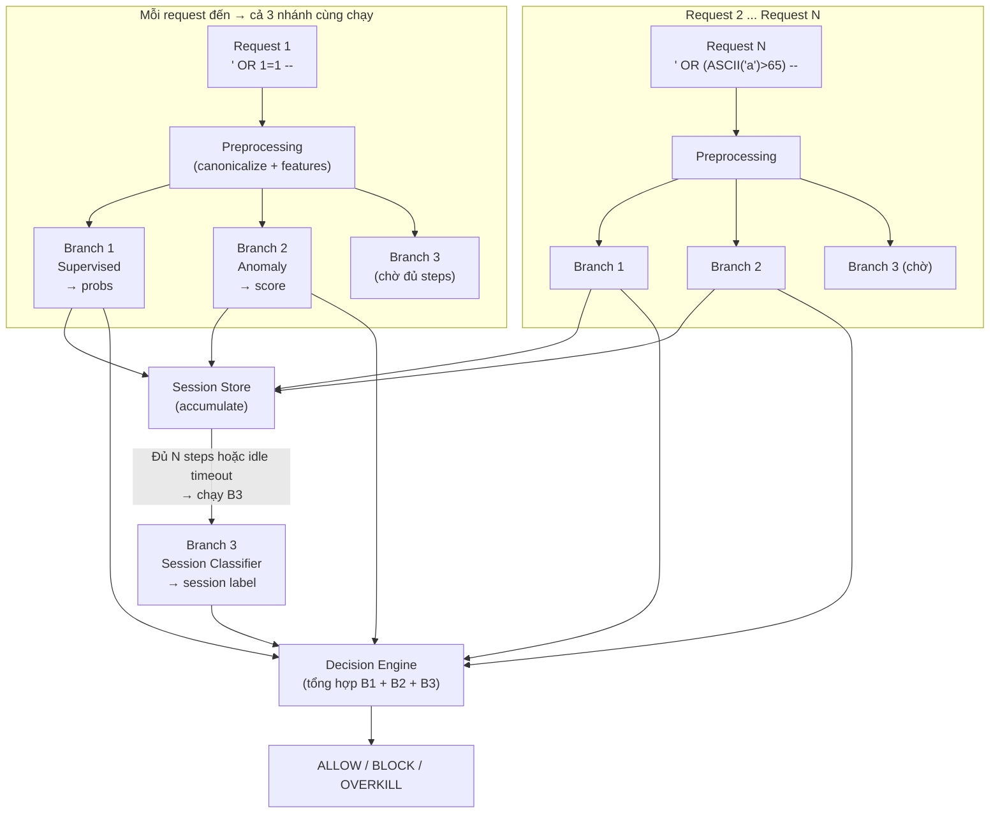
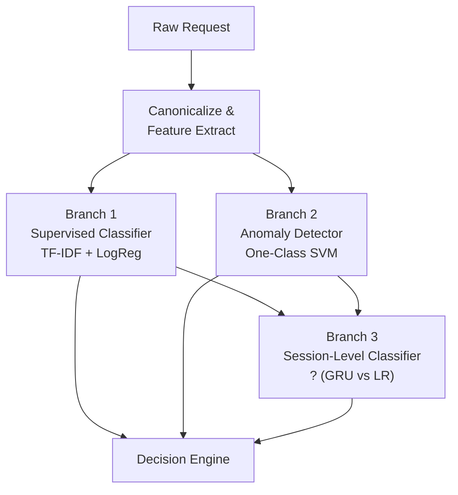
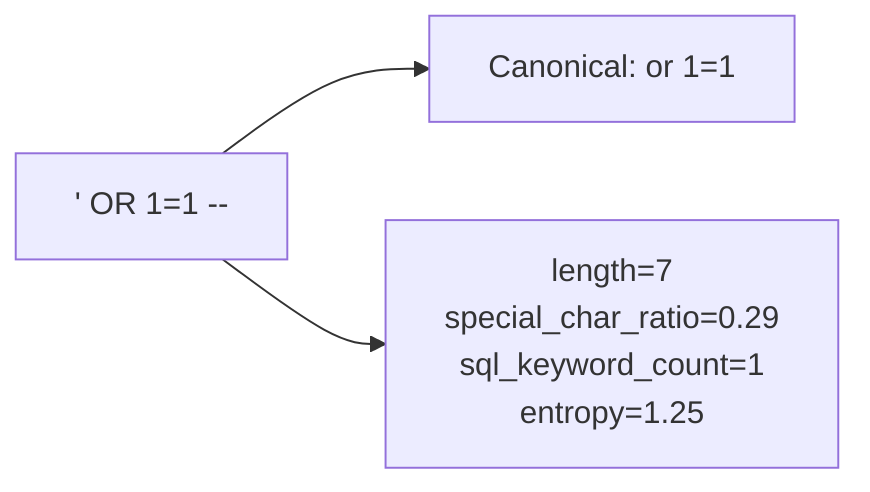
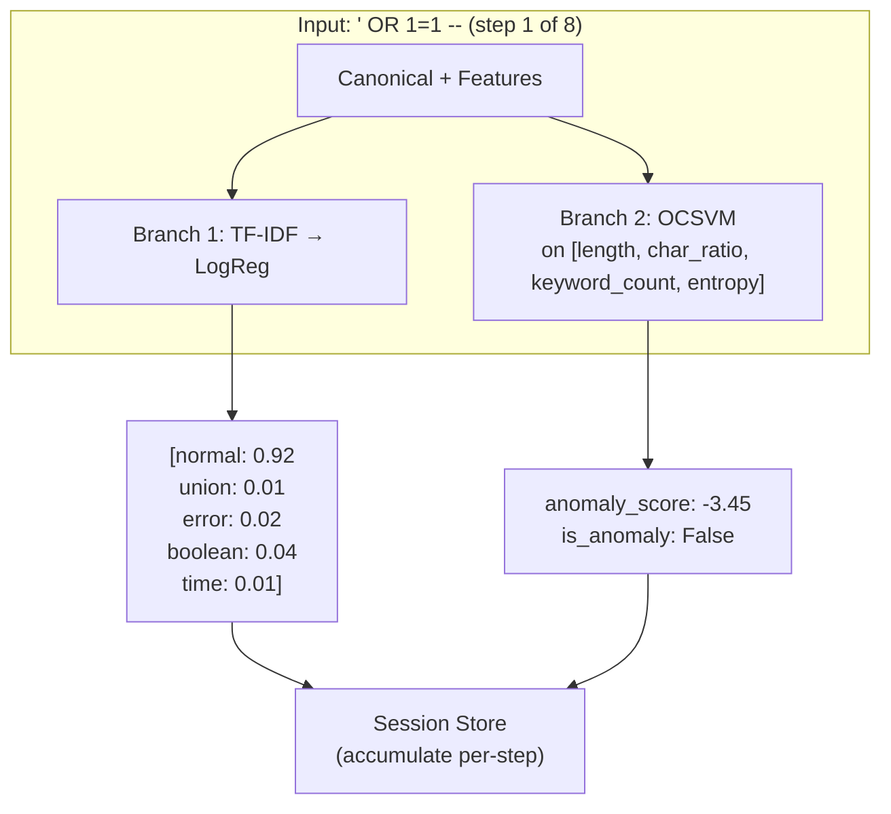
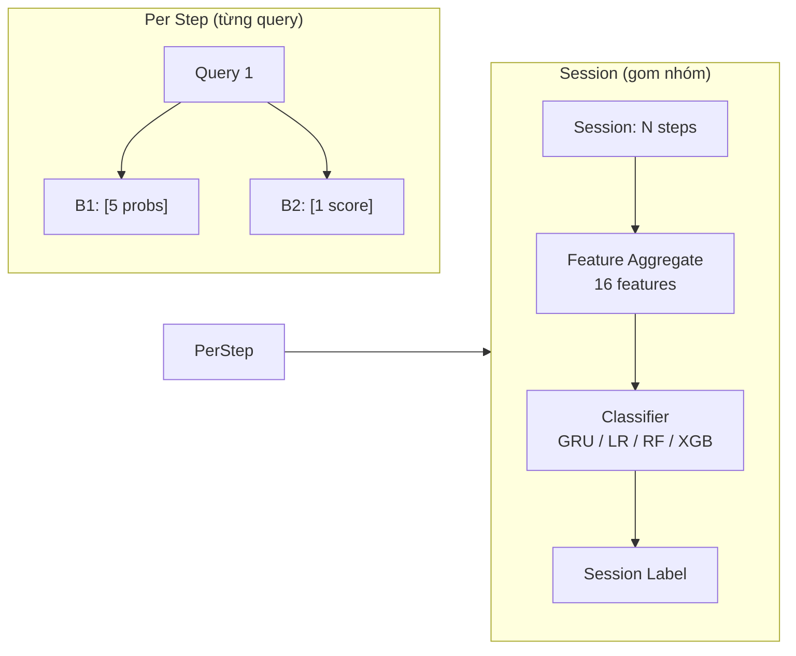
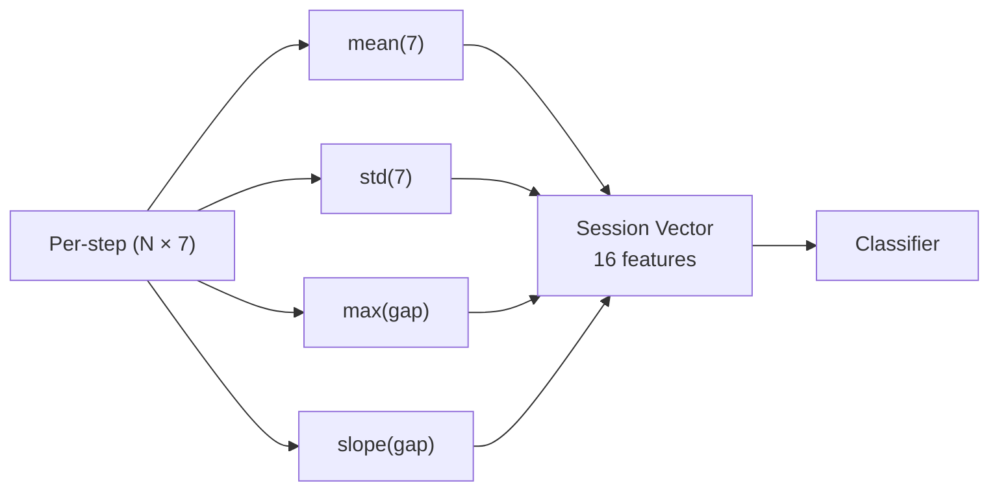
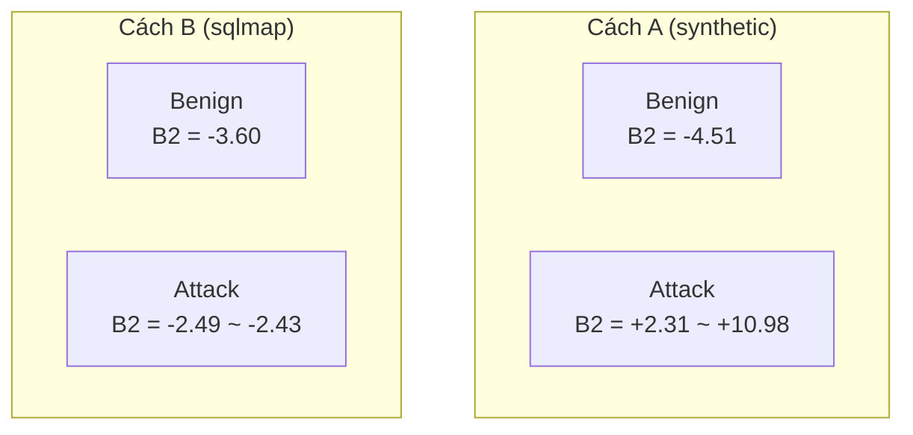
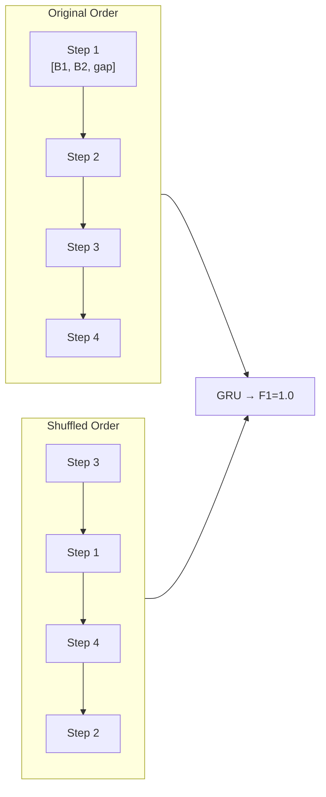
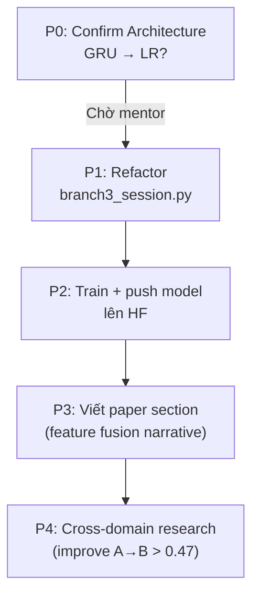

# Branch 3 — Session-Level SQL Injection Detection

## 1. Project Overview

3-branch architecture: **cả 3 nhánh đều chạy trên mọi request**, không phải routing chọn 1 nhánh.



**Giải thích:** B1 và B2 chạy real-time trên từng request (trả lời ngay). B3 là session-level — phải chờ gom đủ requests trong cùng session mới chạy. Decision engine chờ B3 xong mới ra quyết định cuối.

---



| Branch | Input | Output | Algorithm |
|--------|-------|--------|-----------|
| B1 | Raw query text | 5-class probability vector | TF-IDF + LogisticRegression |
| B2 | Statistical features (length, special chars, entropy, keywords) | Anomaly score | One-Class SVM |
| B3 | Sequence of B1 + B2 scores across session steps | Session label (benign / attack type) | **GRU (current) → LR (proposed)** |

### 1.1. Ví dụ cụ thể — một session boolean-blind probing

Giả sử attacker đang dò ký tự đầu tiên của password bằng boolean-blind technique. Họ gửi 8 câu SQL vào hệ thống trong 3 giây:

**Dữ liệu đầu vào (3 nhánh đều nhận, song song):**

```
Request 1:  ' OR 1=1 --           (step 1)
Request 2:  ' OR 1=2 --           (step 2)
Request 3:  ' OR (ASCII('a')>65) --  (step 3)
... (8 requests tổng cộng)
```

**Step 1 — Canonicalize & Feature Extract** (chạy 1 lần cho cả 3 nhánh):



**Step 2 — Cả 3 nhánh chạy song song trên cùng request:**



**Step 3 — Accumulate vào Session Store:**

```
Session ID: client_IP_1234
Steps gom lại bởi: client IP + idle_time < 30 phút

Step 1: B1=[0.92, 0.01, 0.02, 0.04, 0.01], B2=-3.45, gap=0.0s
Step 2: B1=[0.95, 0.01, 0.01, 0.02, 0.01], B2=-3.50, gap=0.4s
Step 3: B1=[0.88, 0.01, 0.01, 0.09, 0.01], B2=-3.30, gap=0.3s
... (8 steps)
```

**Step 4 — Khi session kết thúc (idle > 30 phút), B3 chạy:**

Per-step features (7-d) → aggregate → 16 session features:

```
mean(B1_probs)   = [0.91, 0.01, 0.01, 0.06, 0.01]
std(B1_probs)    = [0.03, 0.00, 0.00, 0.03, 0.00]
mean(B2_score)   = -3.40
std(B2_score)    = 0.10
mean(gap)        = 0.35
std(gap)         = 0.05
max(gap)         = 0.42
slope(gap)       = -0.02
```

**16 features** → LR classifier → **Session Label: boolean_blind (attack)**

**Step 5 — Decision Engine tổng hợp:**

| Branch | Output | Weight |
|--------|--------|--------|
| B1 | normal (confidence 0.92) | B1 bỏ sót — từng câu riêng trông normal |
| B2 | anomaly_score=-3.45 (normal) | B2 cũng bỏ sót — câu ngắn, ít ký tự đặc biệt |
| B3 | **boolean_blind attack** | **B3 phát hiện — vì cả session có pattern** |

→ Decision: **OVERKILL (HOLD for admin review)** vì B1=normal + B2=normal nhưng B3=attack.

**Điểm mấu chốt:** Từng câu riêng lẻ qua B1 trông vô hại, nhưng gom cả mớ requests nhanh + đều + cùng pattern → B3 phát hiện được.

---

## 2. Branch 3 — Chi tiết

### 2.1. Vấn đề

- B1 detect từng câu riêng lẻ → bỏ sót boolean-blind / time-blind probing vì mỗi câu riêng trông normal
- B2 detect bất thường từng câu → không có context về cả session
- Cần phát hiện: "1 câu bình thường, nhưng 50 câu giống nhau trong 5 giây là tấn công"

### 2.2. Data flow



### 2.3. 7 per-step features → 16 session-level features

| # | Feature | Gốc |
|---|---------|-----|
| 1 | branch1_prob_normal | B1 probs |
| 2 | branch1_prob_union_based | B1 probs |
| 3 | branch1_prob_error_based | B1 probs |
| 4 | branch1_prob_boolean_blind | B1 probs |
| 5 | branch1_prob_time_blind | B1 probs |
| 6 | branch2_anomaly_score | B2 score |
| 7 | gap_seconds_log1p | Inter-request timing |

→ Mỗi session → `mean` + `std` cho 7 features (14) + `max` + `slope` cho gap (2) = **16 features**



### 2.4. 2 data sources

| Cách | Nguồn | Số sessions | Đặc điểm |
|------|-------|-------------|----------|
| **A** | Synthetic bisection simulation | 1,400 (350/class × 4) | Đều, sạch, dễ |
| **B** | sqlmap + Docker lab | 92 (20/36/36) | Real noise, không có class 3 |

**Vấn đề B2 polarity (cross-domain gap):**



Cùng attack type nhưng B2 score trái dấu vì data generation khác nhau → cross-domain chỉ đạt 0.47 dù LR là model tốt nhất.

### 2.5. Model comparison (5 architectures)

| Model | Test F1 | Cross A→B | Cross B→A | p50 Latency |
|--------|---------|-----------|-----------|-------------|
| GRU (current) | 1.0 | 0.2500 | 0.4367 | 1.20ms |
| **LogisticRegression** | **1.0** | **0.4722** | **0.4213** | **0.08ms** |
| RandomForest | 1.0 | 0.2500 | — | 31.24ms |
| LightGBM | 1.0 | 0.2500 | — | 1.15ms |
| XGBoost | 1.0 | 0.2500 | — | 0.79ms |

### 2.6. Tại sao GRU không cần thiết?

Shuffle test: xáo trộn thứ tự steps trong session → GRU **vẫn F1=1.0**



**Cả Cách A lẫn Cách B đều không có sequence signal.** Autocorrelation step_n vs step\_{n-1} ≈ 0 cho cả 3 class.

### 2.7. Why not Deep Learning?

| Lý do | Evidence |
|-------|----------|
| No sequence signal | Shuffle test F1 drop = 0.0 |
| Feature space 16-dim, data ~1400 sessions | Small-data regime → DL overfit |
| Cross-domain: DL models = 0.25 (random), LR = 0.47 | DL capacity thừa → memorize pattern ảo |
| Giống B1: DistilBERT / CNN không better LR | Same conclusion across both branches |

---

## 3. Kế hoạch



| Priority | Task | Status |
|----------|------|--------|
| **P0** | Confirm swap GRU → LR với mentor | Chờ |
| P1 | Refactor code (nếu approved) | Chờ |
| P2 | Train model mới, push lên HF | Network blocked |
| P3 | Viết explanation cho paper | To do |
| P4 | Research cải thiện cross-domain | To do |

---

## 4. Files quan trọng

| File | Role |
|------|------|
| `src/models/branch3_session.py` | GRU model wrapper (cần refactor) |
| `src/models/branch3_features.py` | Shared helpers (feature extraction, eval) |
| `train/branch3_lr_features.py` | 16-dim session feature aggregator |
| `train/compare_branch3_architectures.py` | 5-model comparison |
| `train/analyze_cach_b_signal.py` | Cách B signal analysis |
| `configs/config.yaml` | Config (`branch3_session.*`) |
| `deploy/registry.py` | Model loading + inference (`Branch3Model`) |
| `report/metrics/branch3_architecture_comparison.json` | Comparison results |
| `report/metrics/cach_b_signal_analysis.json` | Signal analysis results |
| `report/metrics/branch3_final_report.json` | Consolidated final report |
