# AI-Based SQLi Detection System — Overview

> Hệ thống phát hiện SQL Injection 3 nhánh chạy tại Database Proxy layer

---

## Kiến trúc tổng quan

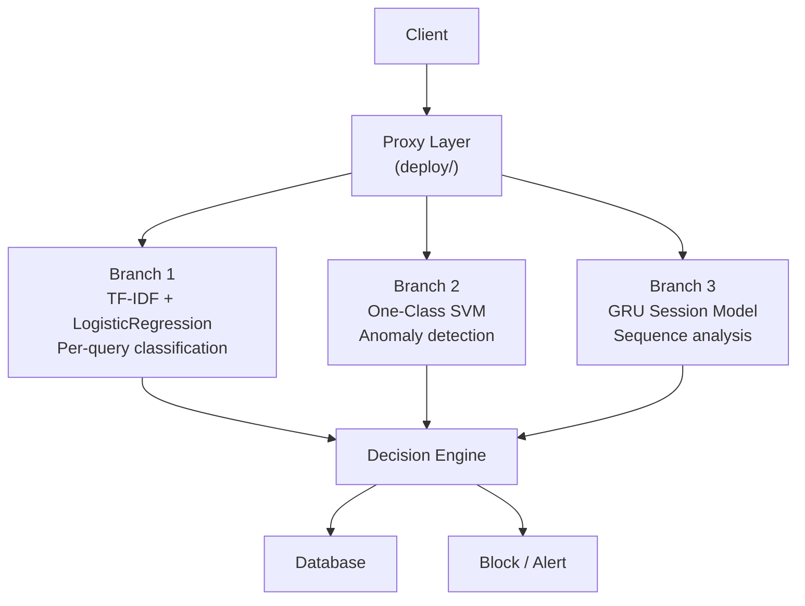

Mỗi request (câu SQL) đi qua 3 nhánh, kết hợp cho quyết định cuối cùng.

### Data Flow — B1 + B2 output làm input B3

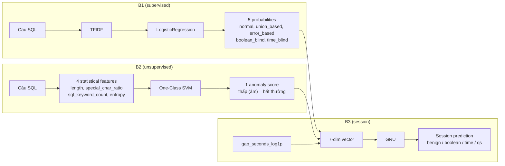

**Cơ chế**: output của B1 (5 số) và B2 (1 số) được **stack** (ghép) thành 1 vector 7 chiều, thêm timing gap làm chiều thứ 7. Các vector này theo thời gian tạo thành sequence → GRU phân loại cả session.

---

## Chi tiết từng nhánh

### Branch 1 — Supervised Classification

| Item | Detail |
|------|--------|
| Input | Query text → canonicalize → TF-IDF vectorize |
| Model | LogisticRegression (multi-class) |
| Classes | normal, union_based, error_based, boolean_blind, time_blind |
| Train | 68k labelled queries from `Jason-42195/VNU-SQLi-Detection` |
| Output | 5-class probability `[p0, p1, p2, p3, p4]` |
| F1-macro | **0.985** (mentor's result) |
| Variants | `branch1_no_boolean_blind`, `branch1_no_time_blind`, etc. — leave-one-out versions dùng cho zero-day test |

### Branch 2 — Anomaly Detection

| Item | Detail |
|------|--------|
| Input | Statistical features (length, special_char_ratio, sql_keyword_count, entropy) |
| Model | One-Class SVM (RBF kernel) trained on 100% benign |
| Output | Continuous anomaly score (higher = more anomalous) |
| Role | Cờ zero-day + feature input cho Branch 3 |

**B2 anomaly score là gì?** `One-Class SVM.decision_function()` trả về 1 số:
- **Cao / dương** → query giống benign (OCSVM nghĩ "bình thường")
- **Thấp / âm** → query khác benign (OCSVM nghĩ "bất thường")

Distribution trên tập session:

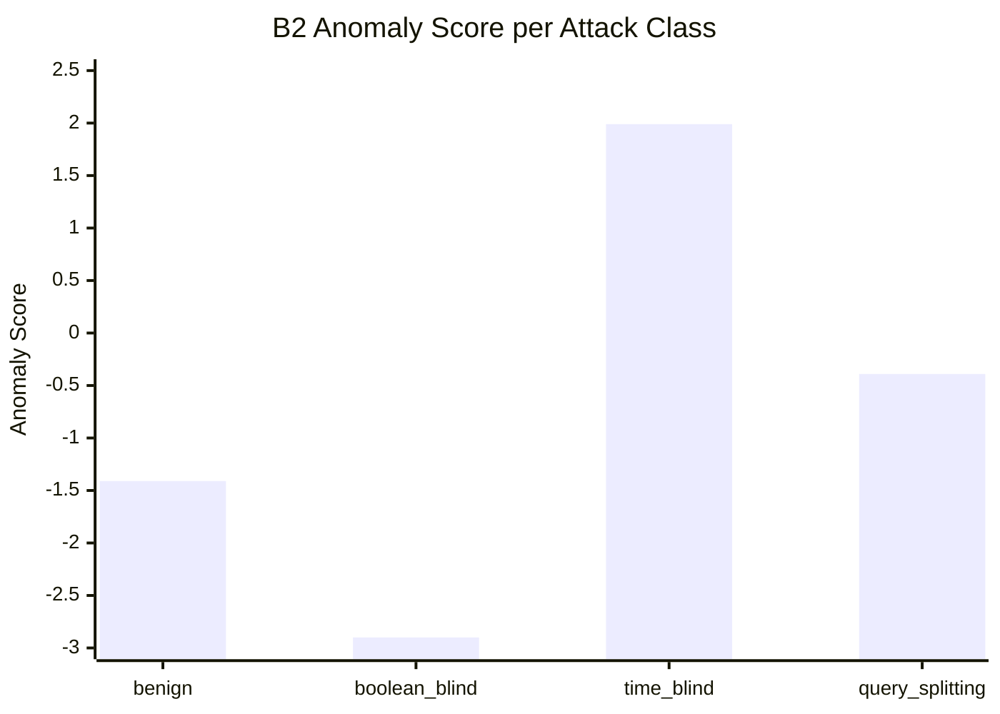

| Class | Score | Ý nghĩa |
|-------|:-----:|---------|
| benign | -1.41 | Baseline — benign query cũng âm nhẹ (OCSVM frontier hẹp) |
| boolean_blind | **-2.90** | Bất thường nhất — statistical features khác benign rõ |
| query_splitting | -0.39 | Hơi bất thường — gần benign |
| time_blind | **+1.99** | Giống benign nhất — `SLEEP(5)` là SQL hợp lệ, OCSVM không thấy lạ |

Lưu ý: **time_blind bị B2 bỏ sót hoàn toàn** (score cao nhất = OCSVM nghĩ nó normal), nhưng B1 bắt được nhờ TF-IDF thấy từ khóa `SLEEP`. Đây là lý do cần cả 2 nhánh.

**Insight từ chart này**: Chỉ cần nhìn vào mean B2 score là đã phân biệt được 4 class — benign (-1.41), boolean_blind (-2.90), query_splitting (-0.39), time_blind (+1.99). Đây chính là lý do B3 đạt accuracy 1.0 một cách giả tạo: GRU chỉ cần lấy trung bình B2 score của cả session là classify được, không cần học sequence gì cả.

### Branch 3 — Session Sequence Model

| Item | Detail |
|------|--------|
| Input | 7-dim feature vector per step (5 B1 probs + 1 B2 score + 1 gap) |
| Architecture | GRU(7→32→4), 4068 parameters |
| Classes | benign(0), boolean_blind(1), time_blind(2), query_splitting(3) |
| Training | Session-level (mỗi session là 1 sequence) |
| Output | 4-class prediction per session |

---

## Branch 3 Feature Pipeline

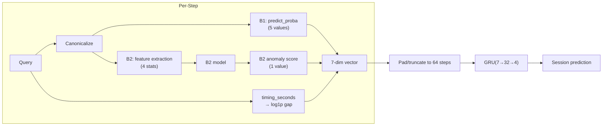

**Feature vector composition:**
```
dim 0-4:  [B1] normal, union_based, error_based, boolean_blind, time_blind
dim 5:    [B2] anomaly score (OCSVM decision_function)
dim 6:    [B2] gap = log1p(timing_seconds)
```

---

## 6 Phase Plan

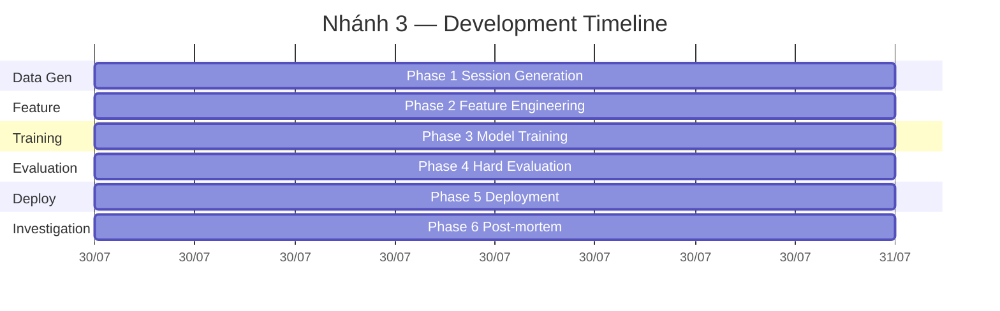

---

## Kết quả từng Phase

### Phase 1 — Data Generation

**Methodology**: Chạy `build_session_dataset.py` → dùng `train/attack_simulator.py` sinh session bằng cách thực thi attack thật lên demo DB:
- **boolean_blind**: bisection search trên ký tự username, ~7 requests/char, dựa vào row count
- **time_blind**: bisection search dùng `SLEEP()`, ~7 requests/char, dựa vào timing
- **query_splitting**: inject `;` + câu query mới
- **benign**: gõ query thật từ user pool (500 users)

Generated 800 sessions per split (200/class), ~50k rows:

| Class | Train | Test |
|-------|-------|------|
| benign | 200 | 200 |
| boolean_blind | 200 | 200 |
| time_blind | 200 | 200 |
| query_splitting | 200 | 200 |

- Session diversity: boolean_blind 96%, time_blind 96%, query_splitting 99%
- Mỗi session homogeneous (cùng attack type)

### Phase 2 — Feature Engineering

**Methodology**: Mỗi câu SQL trong session → vector 7 chiều:
- **dim 0-4**: `B1.predict_proba()` → 5 probabilities (normal, union, error, boolean, time)
- **dim 5**: `B2.decision_function()` → 4 statistical features → One-Class SVM anomaly score
- **dim 6**: timing gap `log1p(seconds_since_last_query)`, step 0 = 0
- Pad/truncate về đúng 64 steps (0 cho step > session length)

Output shape: (2000, 64, 7) per split.

### Phase 3 — Model Training

**Methodology**:
- Train/val split: 80/20 trên 1600 training sessions
- Architecture: GRU(7→32→4), 4068 parameters, bidirectional=false
- Loss: CrossEntropy, Optimizer: Adam (lr=0.001)
- Early stopping patience=10 epochs trên val loss
- Mỗi ablation config chạy lại từ đầu với input dimension thay đổi tương ứng

> **Ablation = thí nghiệm "cắt bỏ" từng thành phần của model để kiểm tra tầm quan trọng của nó.**
> Nếu bỏ feature X mà accuracy không đổi → X là redundant. Nếu accuracy giảm mạnh → X quan trọng.
> Trong project này, ablation giúp phát hiện feature nào thực sự đóng góp cho B3.

**Ablation Study:**

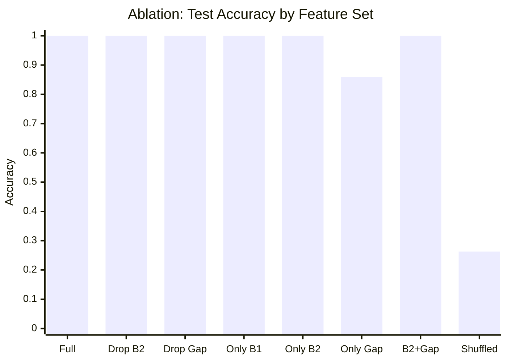

| Feature set | Accuracy | Ý nghĩa |
|-------------|:--------:|---------|
| Full (7-dim) | 1.0 | Baseline |
| Drop B2 | 1.0 | B2 redundant — bỏ anomaly score không ảnh hưởng |
| Drop Gap | 1.0 | Timing redundant |
| Only B1 | 1.0 | Chỉ B1 probs cũng đủ 1.0 — class-mean signal mạnh nhất |
| Only B2 | 1.0 | Chỉ B2 score cũng đủ — 4 class means separable |
| Only Gap | 0.859 | Timing một mình không đủ |
| B2+Gap | 1.0 | B2 + timing cũng đủ |
| Shuffled | 0.263 | Xáo trộn step order → gần random — sequence có đóng góp nhưng vì data artifact |

**Key finding**: 5/8 configs đạt accuracy 1.0 — bất kỳ tổ hợp nào chứa B1 probs hoặc B2 score đều đủ để classify. Sequence signal không thực sự đóng góp (shuffle accuracy ~0.26 = gần random cho 4 classes).

### Phase 4 — Hard Evaluation

**Methodology**:
- **4.1 Shuffle**: random shuffle step order trong từng session (giữ nguyên features, chỉ đảo sequence) → nếu GRU học được sequence, accuracy phải giảm
- **4.2 Zero-day**: dùng B1 leave-one-out variants (bỏ 1 class khỏi training) → test B3 trên session của class bị bỏ → recall=0 nghĩa là B3 không tự phát hiện được class lạ nếu B1 miss
- **4.3 Ablation**: chạy lại 8 configs từ Phase 3 trên test set để confirm consistency
- **4.4 Diversity**: đếm số `(target_username, ground_truth_char)` distinct pairs trong generated data → 100% = attack simulator không bị memorization trap

| # | Test | Result | Detail |
|---|------|--------|--------|
| 4.1 | Shuffle test | ❌ | F1 không đổi (0.375 → 0.375) — GRU không dùng step order |
| 4.2 | Zero-day boolean_blind | ❌ | 0% recall — B3 không bắt được boolean_blind nếu B1 miss |
| 4.2 | Zero-day time_blind | ✅ | 100% recall — B2 anomaly score đủ mạnh |
| 4.3 | Ablation (reuse) | ✅ | Consistent với Phase 3 |
| 4.4 | Diversity | ✅ | 100% distinct traces |
| | **Gate** | **❌ FAIL** | Synthetic data artifact, không thể deploy |

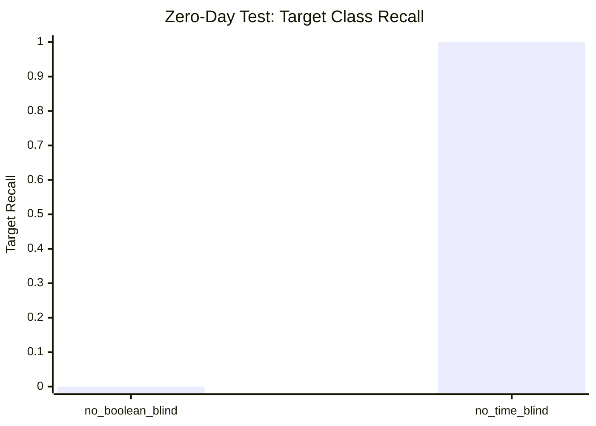

---

## Phase 6 — Post-mortem: Synthetic Data Artifact Investigation

Phase 4 xác nhận 100% accuracy là artifact. Phase 6 thử 3 hướng cải tiến để xem có recover được sequence signal không.

**Methodology**:
- **6.1 Delta features**: thay absolute feature `f[t]` bằng `Δ[t] = f[t] - f[t-1]` (Δ[0] = 0). Mục đích: loại bỏ class-mean signal, buộc GRU học step-to-step thay đổi
- **6.2 Drop B2 + delta**: giống 6.1 nhưng cột B2 anomaly score cũng biến thành delta → mất nốt 1-dim class-mean cuối cùng. Input 6-dim (B1 deltas + gap delta)
- **6.3 Mixed sessions**: prepend benign steps vào đầu attack session (3 ratios: 1:2, 1:1, 2:1 benign:attack). Mục đích: giả tạo mixed-class session để sequence có ý nghĩa

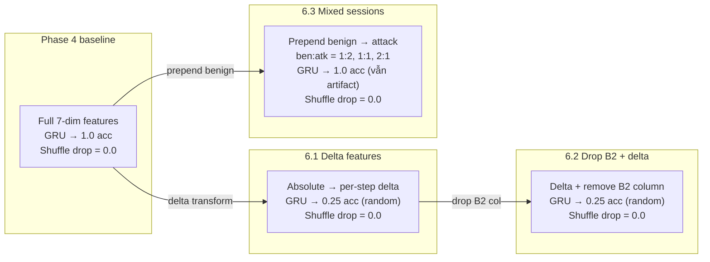

### Kết quả

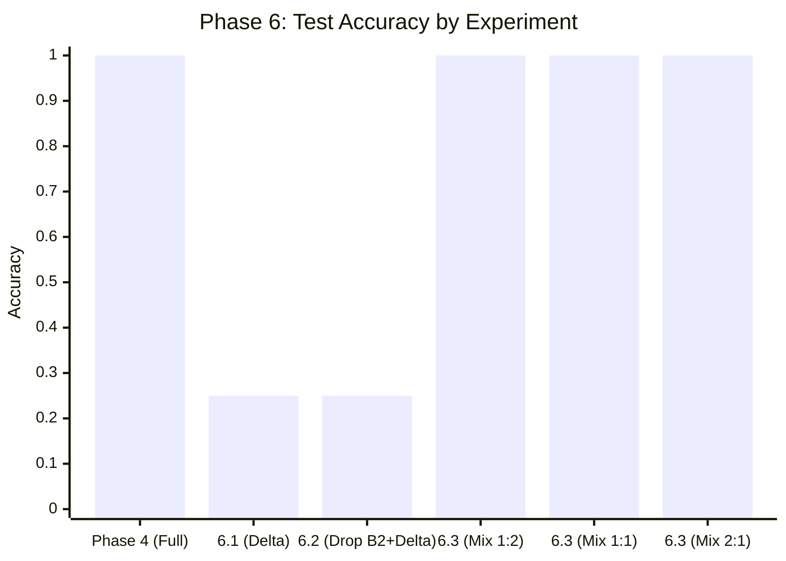

| Exp | What | Accuracy | Shuffle drop | Root cause |
|-----|------|:---------:|:------------:|------------|
| 6.1 | Delta features | 0.25 ❌ | 0.0 | Deltas xoá class-mean signal, không còn gì để học |
| 6.2 | Drop B2 + delta | 0.25 ❌ | 0.0 | Same as 6.1, B2 delta zero-info |
| 6.3 | Mixed sessions (3 ratios) | 1.0 ❌ | 0.0 | B1 bắt từng câu quá tốt, benign prefix không đủ nhiễu |

### Phase 6 insights

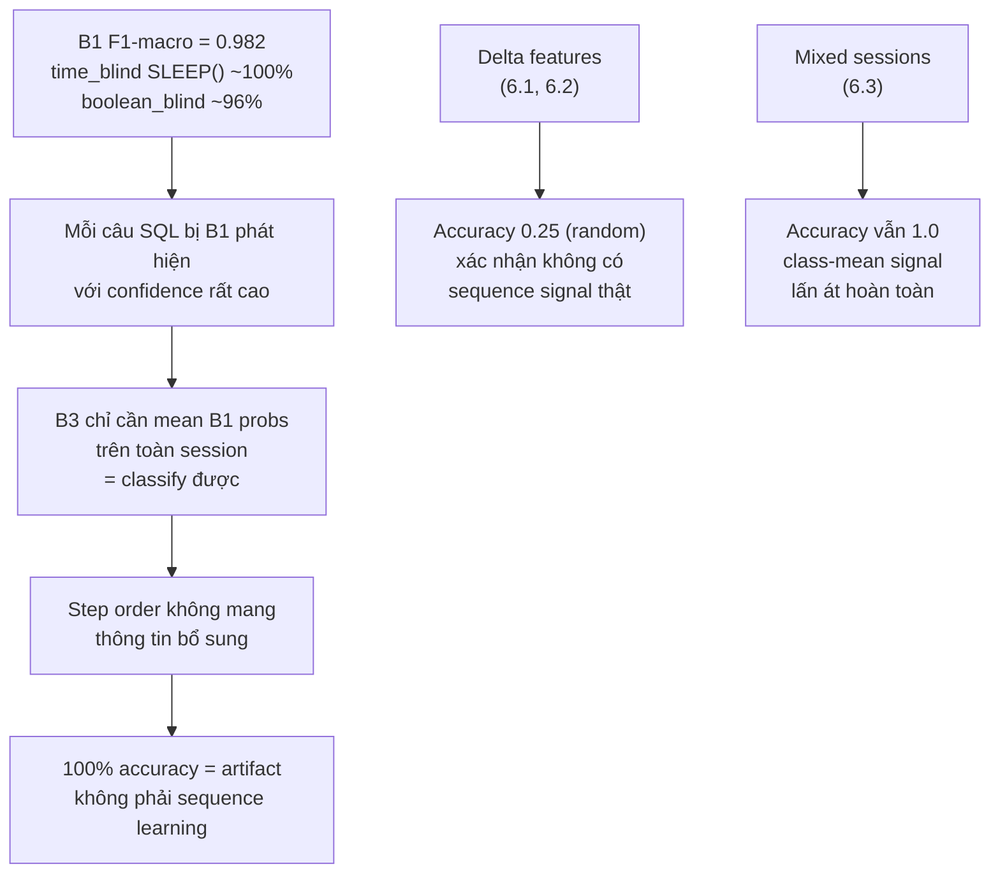

### Why delta features kill accuracy

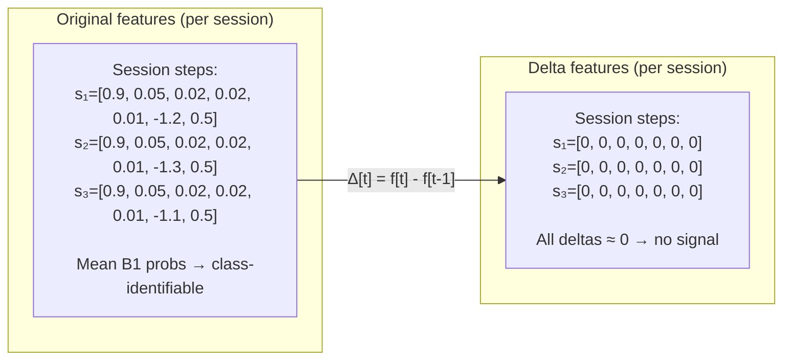

Vì session chỉ có 1 loại attack, câu nào cũng giống hệt câu nào — step[1] trừ step[2] = 0, step[2] trừ step[3] = 0, ... → delta toàn số 0. GRU thấy toàn 0 thì dạy được gì?

---

## Root Cause Analysis

**Vì sao 100% test accuracy là artifact?**

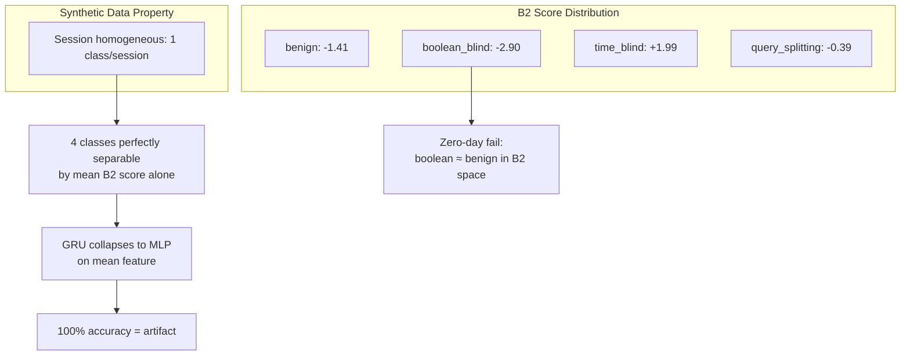

### Root cause hierarchy (expanded)

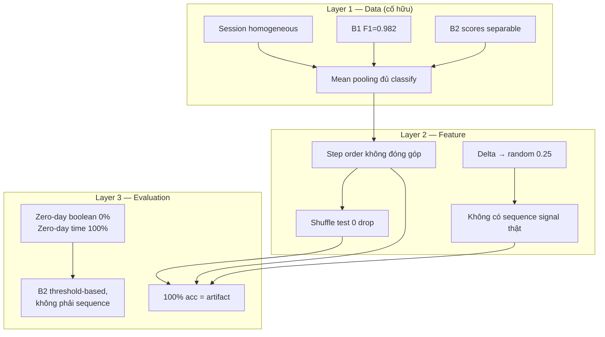

1. **Homogeneous sessions**: mỗi session chỉ chứa 1 attack type → classification = bag-level mean pooling
2. **B2 score distribution**: 4 class means perfectly separable → 1-dim MLP đạt 1.0
3. **GRU không dùng sequence**: shuffle test 0 drop chứng minh
4. **Zero-day không robust**: boolean_blind (-2.90) quá gần benign (-1.41) trong B2 space
5. **Phase 6 confirmation**: delta → 0.25; mixed sessions → vẫn 1.0; cả 3 experiment đều 0 shuffle drop

---

## Conclusion

> **B3 trên synthetic data**: 100% accuracy là artifact — đã xác nhận qua 3 experiment (delta → random, mixed → vẫn artifact, shuffle → 0 drop everywhere). Cần real mixed-session production traffic để đánh giá B3 thực sự.
>
> **Giá trị thực tế**: B1 + B2 combo đã đạt F1-macro 0.985 + zero-day flags. B3 không add value trên synthetic data. Session model chỉ có ý nghĩa khi có data thật với multi-class sessions.
>
> **Phase 6 key finding**: Synthetic data artifact là cố hữu — không thể fix bằng feature engineering (delta, drop B2) hay data mixing. B1 per-query detection quá mạnh, không còn sequence signal để học.
>
> **Paper narrative**: Thiết kế 3-branch, train B3, hard evaluation → phát hiện synthetic data artifact. 3 experiment confirm: sequence signal = 0 trong synthetic session data. Bài học về evaluation methodology cho security ML trên synthetic data.

---

*File: `report/docs/index.md` — cập nhật 30/07/2026*
