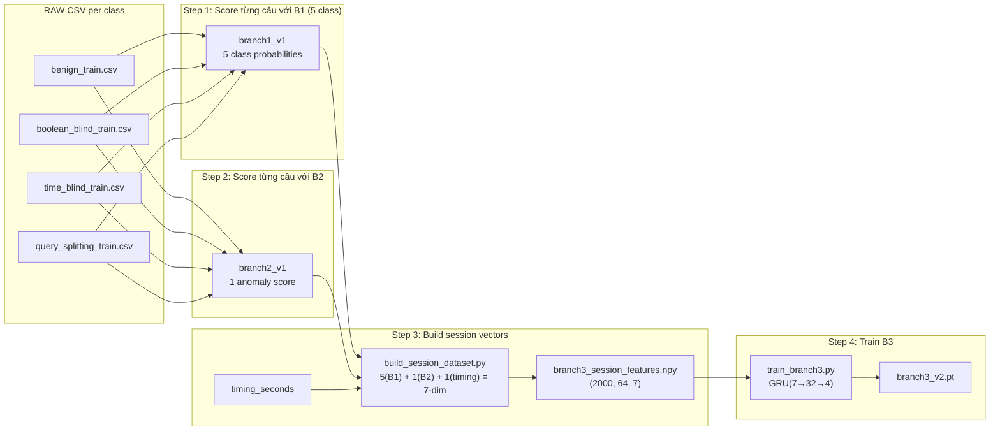
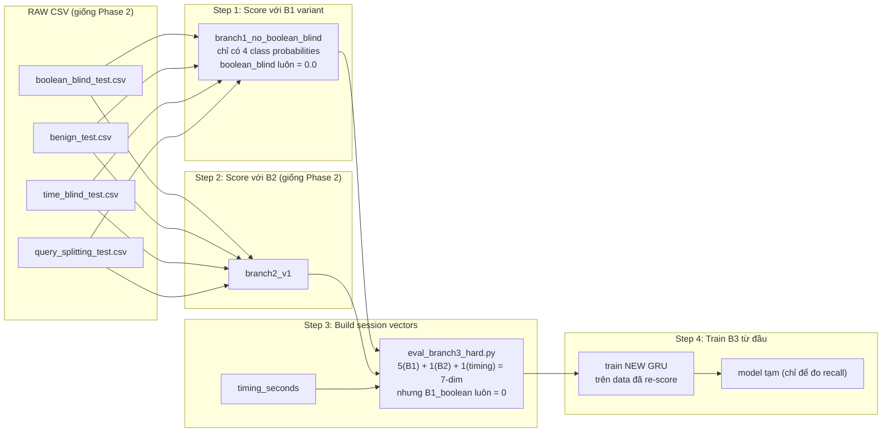
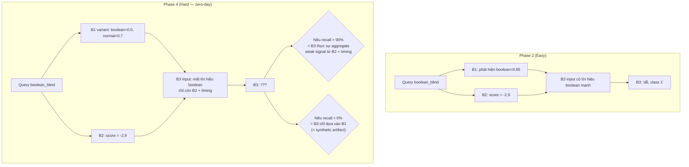

# Phase 2 vs Phase 4 — B3 Training Pipeline

> So sánh trực quan quy trình xử lý dữ liệu và training Branch 3

---

## Phase 2: Feature Engineering (tạo dataset train B3)

B1 **đầy đủ 5 class** — mục đích: tạo feature vectors chuẩn cho B3 học.

**Ví dụ 1 câu boolean_blind trong Phase 2:**

| step | B1_normal | B1_union | B1_error | B1_boolean | B1_time | B2_score | gap |
|------|-----------|----------|----------|------------|---------|----------|-----|
| 1 | 0.02 | 0.01 | 0.00 | **0.85** | 0.12 | -2.90 | 0.015 |
| 2 | 0.03 | 0.01 | 0.00 | **0.82** | 0.14 | -2.88 | 0.016 |
| 3 | 0.02 | 0.00 | 0.00 | **0.88** | 0.10 | -2.92 | 0.014 |

→ B1 cho boolean_blind probability cao → B3 dễ dàng học "cột này = boolean"

---

## Phase 4: Zero-Day Test (hard evaluation)

B1 **thiếu 1 class** — mục đích: test B3 có còn bắt được attack khi B1 mù không.

**Ví dụ 1 câu boolean_blind trong Phase 4:**

| step | B1_normal | B1_union | B1_error | B1_boolean | B1_time | B2_score | gap |
|------|-----------|----------|----------|------------|---------|----------|-----|
| 1 | **0.70** | 0.12 | 0.08 | **0.00** | 0.10 | -2.90 | 0.015 |
| 2 | **0.68** | 0.14 | 0.09 | **0.00** | 0.09 | -2.88 | 0.016 |
| 3 | **0.72** | 0.11 | 0.07 | **0.00** | 0.10 | -2.92 | 0.014 |

→ B1 đẩy probability vào **normal** (0.70), không còn biết đây là boolean_blind nữa → B3 phải dựa vào B2 score + timing để đoán

---

## Tổng quan 2 Phase

## Tại sao Phase 4 quan trọng?

Trong production, attacker có thể dùng kỹ thuật mới mà B1 chưa thấy bao giờ (zero-day). Nếu B3 chỉ dựa vào B1 thì vô dụng. Phase 4 kiểm tra: **B3 có thực sự aggregate weak signal từ B2 và timing pattern không?**

Kết quả thực tế: **không** — B3 chỉ đạt 0% recall cho boolean_blind khi B1 mù. Chứng tỏ B3 trên synthetic data hiện tại không có zero-day robustness.
