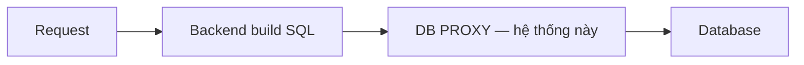
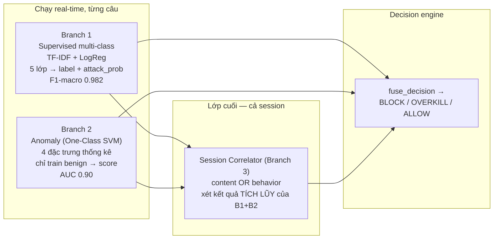
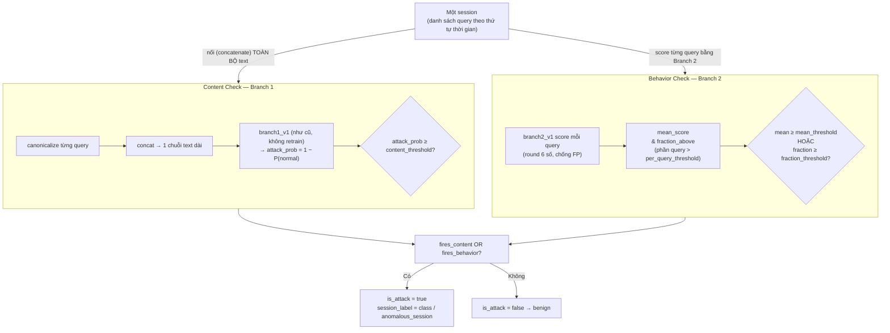
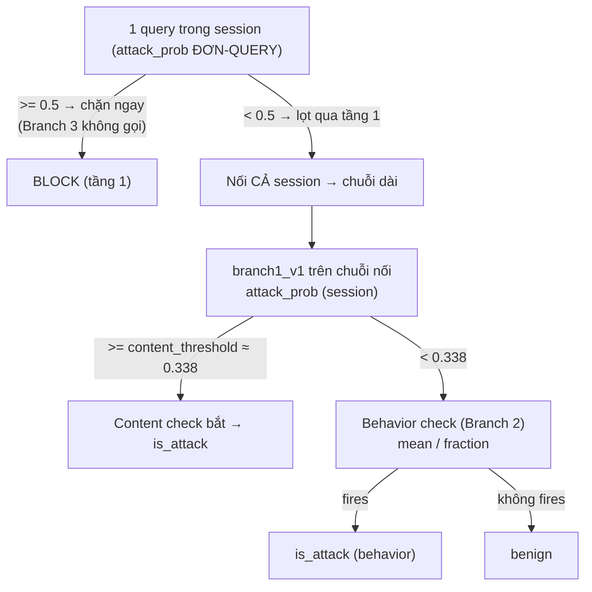
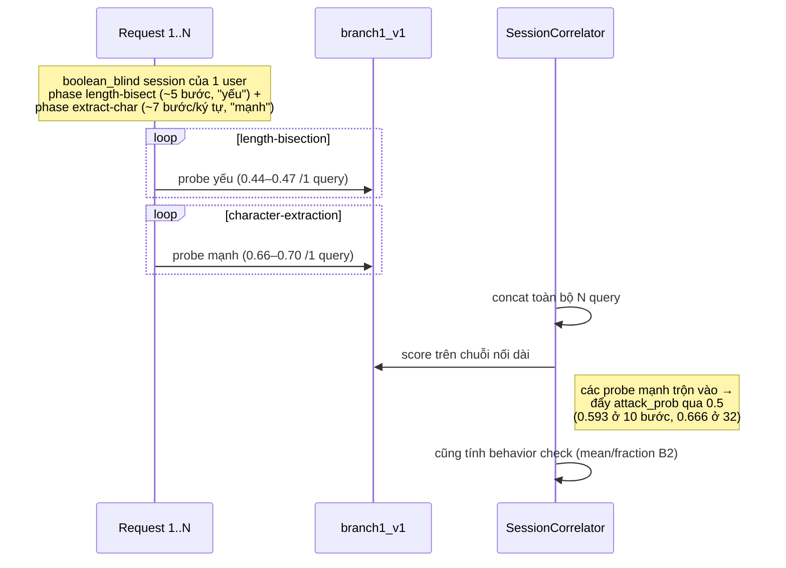
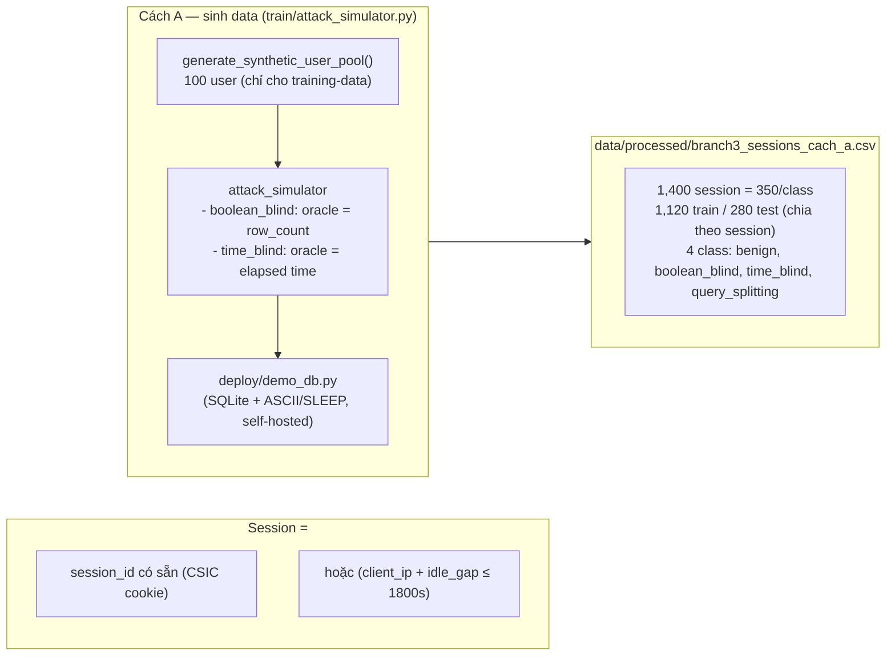
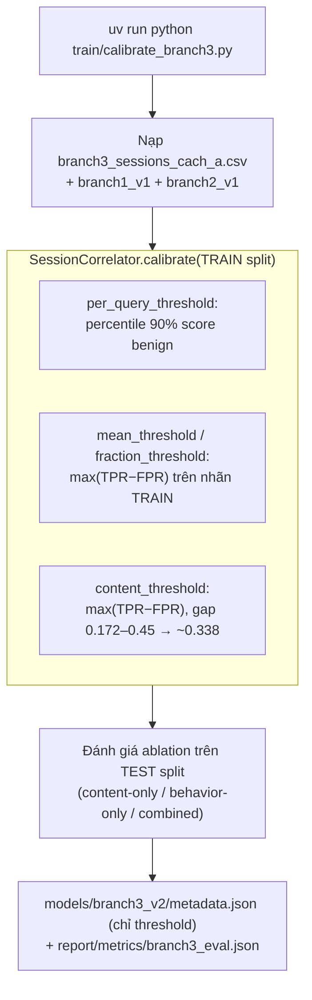
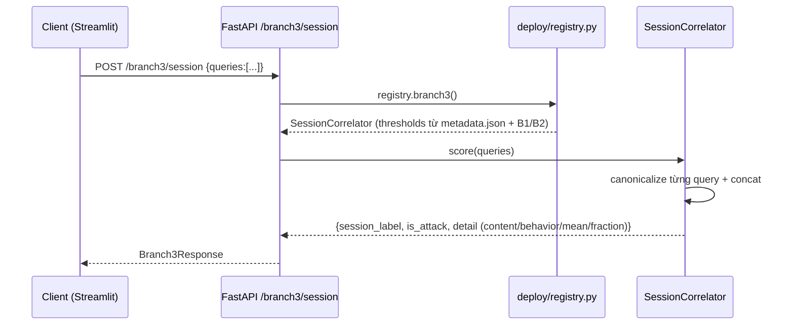
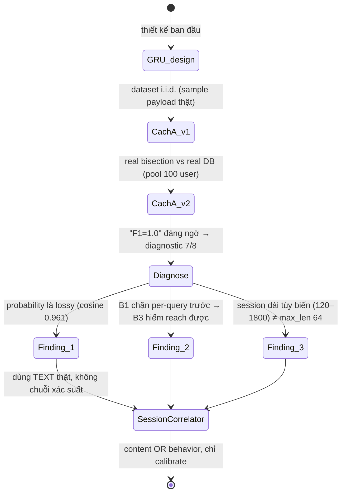

# Thiết kế Branch 3 — Session Correlator (bản xoá hẳn GRU)

> Tổng hợp từ `report/plan/data_contract.md` §4.0–4.2 + `src/models/branch3_session.py` + `train/calibrate_branch3.py` + `deploy/routers/branch3.py` + bản viết lại của mentor (thứ tự Decision Engine, đổi tên Session Correlator).
> Mục đích: hình dung **hệ thống hiện tại** dễ dàng (nhiều mermaid). Không phải doc chính — doc chính vẫn là `data_contract.md §4.2`.

---

## 0. Vị trí hệ thống — DB Proxy

Proxy nhận câu SQL **sau khi backend build xong**, trước khi tới DB thật. Toàn bộ 3 nhánh chạy ngay tại đây trên từng câu `query`.

## 0.1. Canonicalization (đầu vào chung)

Mọi query đi qua đều được chuẩn hóa trước (`src/preprocessing/canonicalize.py`): giải mã encoding (URL/hex/CHAR()), chuẩn hóa hoa/thường từ khóa SQL, đánh dấu (không xóa) comment `/* *//*--`. Kết quả `query_canonical` là input chung cho cả 3 nhánh.

---

## 1. Thứ tự các lớp — Nhánh 1 → Nhánh 2 → Session Correlator (lớp CUỐI)

Branch 1 và Branch 2 chạy **real-time, theo từng câu**, ngay khi request tới. Session Correlator (Branch 3) là **lớp cuối cùng**, xét trên kết quả tích lũy của Branch 1 + Branch 2 qua **nhiều câu trong cùng session** → về mặt kiến trúc nó nằm SAU 2 nhánh kia, không chạy song song hay trước.

> **Bảng quyết định (thứ tự 3 lớp, đúng bản mentor):**

| Nhánh 1 (từng câu) | Nhánh 2 (từng câu) | Session Correlator (cả session) | Hành động |
|---|---|---|---|
| lớp tấn công | — (chưa xét tới) | — (chưa cần xét) | **BLOCK** ngay câu đó, ghi log |
| normal | anomaly = 1 | — (chưa cần xét) | **OVERKILL** — giữ lại chờ Admin xác nhận; hết giờ → deny mặc định |
| normal | anomaly = 0 | phát hiện session là tấn công (content **hoặc** behavior fire) | **BLOCK/OVERKILL cả session** — leo thang dù từng câu riêng lẻ đã "sạch" |
| normal | anomaly = 0 | session sạch (hoặc chưa đủ dữ liệu) | **ALLOW** |

Nói cách khác: B1 và B2 quyết định số phận **từng câu** ngay lập tức; Session Correlator là lớp giám sát bổ sung phía sau, có quyền **lật ngược** quyết định "cho qua" của 1 câu nếu nhìn vào cả bối cảnh session mới thấy là tấn công.

> **Ghi chú kỹ thuật (không đổi ý nghĩa logic):** trong code thật `fuse_decision()` (deploy/routers/detect.py:40), Session Correlator được kiểm tra **trước tiên trong hàm** — đây chỉ là tối ưu short-circuit để trả kết quả sớm, không thay đổi thứ tự logic: nó vẫn là lớp xét **trên kết quả tích lũy** của B1+B2.

> **Điểm mấu chốt (Finding 2):** Branch 1 chặn mọi query có `attack_prob ≥ 0.5` (decision_threshold) ngay ở tầng đơn-query → Session Correlator chỉ "đáng nghĩ tới" cho session mà Branch 1 **không nhận ra per-query** (như boolean_blind bị blind). `time_blind` (chuỗi `SLEEP()`) bị Branch 1 bắt ~100% ở request #1 → thực tế không bao giờ chạm tới Branch 3.

---

## 2. Kiến trúc Session Correlator — cơ chế ghép, ví dụ cụ thể

> **Trả lời trực tiếp câu hỏi "ghép cái gì?":** KHÔNG phải ghép các field trong 1 request. Nó ghép **nhiều query từ nhiều request khác nhau, trải dài trong 1 session** — mỗi request chỉ mang 1 câu SQL. "Session" = 1 chuỗi request liên tiếp của cùng 1 người dùng/IP (gom theo `session_id` hoặc IP + cửa sổ thời gian nghỉ 1800s ≈ 30 phút).

> (Một hướng khác — ghép nhiều field trong **CÙNG 1 request**, như form login có cả username + password cùng vào 1 câu `WHERE` — đã thử riêng trong Experiment A1 và thấy **KHÔNG cần**: từng field kiểm tra riêng lẻ đã bắt được payload (0.87–0.99 attack probability), nên cơ chế đó không được đưa vào Session Correlator.)

**Ví dụ cụ thể** với DB demo (`deploy/demo_db.py`), bảng `users(id, username, email, password, role)`, backend build kiểu `SELECT * FROM users WHERE username = '{input}'`. Kẻ tấn công muốn lấy password của `alice` bằng **boolean-blind** — không thể làm trong 1 request, phải dò từng bit qua rất nhiều request, tất cả thuộc cùng 1 session:

- **Request 1** (dò độ dài): `zzz' OR ((SELECT LENGTH(password) FROM users WHERE username='alice') > 8)--`
- **Request 2-4...** (nhị phân dò độ dài): `> 4, > 6, > 7...` cho tới khi xác định đúng độ dài (vd: 10 ký tự).
- **Từ request ~5** (dò từng ký tự bằng ASCII, ~7 request/ký tự): `zzz' OR ((SELECT ASCII(SUBSTR(password,1,1)) FROM users WHERE username='alice') > 100)--`, rồi `> 108`, `> 104`... đến khi xác định đúng ký tự đầu, rồi sang ký tự 2...
- Một session hoàn chỉnh có thể lên tới **30+ request riêng lẻ**, mỗi request là 1 dòng trong log của Nhánh 1/Nhánh 2.

**Vì sao OR, không dựa 1 check:** mỗi check bù blind-spot cho check kia
- **Content check** bắt: text trông "lexically attack" nhưng cấu trúc không nổi bật (VD probe boolean_blind yếu, từng bước 0.44–0.47 dưới ngưỡng đơn-query, nhưng **nối nhiều bước** sẽ đẩy lên).
- **Behavior check** bắt: text trông mơ hồ về lexical nhưng **cấu trúc lạ** (nested `OR`/subquery → special_char_ratio, keyword_count cao) → dù Branch 1 không nhận class cũng vẫn anomalous.
- **Lỗ hổng thật (đã thú nhận):** kẻ tấn công né **CẢ HAI** — mimic lexical benign + mimic shape benign → không phải lỗi fix được, nằm ở Limitations.

---

## 2.5. Làm rõ "0.5 ăn luôn" vs "0.338 content check" — HAI ngưỡng, HAI tầng

Đây là điểm hay nhầm nhất. Cùng một model `branch1_v1`, **dùng ở 2 chỗ khác nhau với 2 ngưỡng khác nhau** → nhìn tưởng mâu thuẫn, thực ra không.

### Tầng 1 — Per-query (decision engine, live): ngưỡng `0.5`
- `deploy/routers/detect.py:fuse_decision` xét **TỪNG QUERY đơn lẻ**.
- Nếu một query có `attack_prob ≥ decision_threshold (0.5)` → **BLOCK ngay**, Branch 3 **KHÔNG bao giờ được gọi** cho query đó.
- → Câu "B1 prob > 0.5 ăn luôn không cần Branch 3" đúng **ở tầng này**.

### Tầng 2 — Session-level content check (SessionCorrelator): ngưỡng `~0.338`
- Chỉ xảy ra khi **MỌI query riêng lẻ đều < 0.5** — nếu không thì đã bị chặn ở tầng 1 rồi. Nghĩa là session này **đã lọt qua được Branch 1 per-query**.
- Lúc này Branch 3 mới được gọi và content check làm 3 việc:
  1. **Nối (concatenate) TOÀN BỘ text** của session → 1 chuỗi dài (không phải 1 query nữa).
  2. Chạy **cùng `branch1_v1`** lên chuỗi nối đó.
  3. So `attack_prob` với `content_threshold` (~0.338 — calibrate riêng, **THẤP hơn 0.5**).

### Vì sao nối lại giúp ích (trả lời "sao mà tăng lên được?")
Một probe yếu riêng lẻ chỉ 0.44–0.47 (đã < 0.5 nên lọt qua tầng 1). Nhưng một session boolean-blind thật có **2 phase**:
- Phase length-bisection: ~5 bước probe **yếu** (0.44–0.47).
- Phase extract-char: ~7 bước/ký tự probe **mạnh** (0.66–0.70).

Khi nối cả session, các probe **mạnh** (của phase extract) trộn vào → `attack_prob` của chuỗi nối bị **đẩy lên**: 0.593 ở 10 bước, 0.666 ở 32 bước. Vượt ngưỡng 0.338 → content check bắt được session dù từng query đều "quá yếu" để bị chặn riêng.

> ⚠️ Lưu ý chính xác (ghi chính xác hơn trong data_contract §4.2): nếu chỉ nối **đúng các bước yếu** (riêng phase length-bisection, không có probe mạnh) thì sẽ không vượt 0.5 một mình (dừng ở 0.45–0.46). Điều đẩy lên là **có probe mạnh trộn vào**, không phải "nhiều mảnh yếu tích lũy". Chính vì thế mà **Behavior check (Branch 2)** tồn tại — nó bắt được cả trường hợp session chỉ gồm toàn bước yếu (mean_score 2.171 ≫ mean_threshold −4.465).

### Bảng so sánh 2 tầng

| | Tầng 1 (per-query) | Tầng 2 (session content check) |
|---|---|---|
| Nơi chạy | decision engine (`fuse_decision`) | SessionCorrelator |
| Input | **1 query** | **cả session nối thành 1 chuỗi** |
| Model | `branch1_v1` | `branch1_v1` (cùng) |
| Ngưỡng | `0.5` | `~0.338` (calibrate riêng) |
| Khi nào xét | mọi query | chỉ khi mọi query lọt qua tầng 1 |
| Hành động | BLOCK | content check → is_attack |

> Vì `content_threshold` (0.338) < ngưỡng per-query (0.5) nên một session "yếu-toàn-bộ" vẫn có thể bị content check bắt ở **tầng session** — thứ mà bạn không bao giờ bắt được bằng cách chấm từng query riêng lẻ. Đó chính là giá trị của Branch 3.

---

## 3. Vì sao phải "OR" và vì sao nối text lại hoạt động (Finding 1 + Experiment)

- **Finding 1 (information bottleneck đã đo):** Branch 1 output là xác suất lớp (lossy), KHÔNG phải content embedding. 2 bước bisection chỉ khác bound (`>79` vs `>103`) có TF-IDF cosine **0.961** nhưng xác suất gần như giống → GRU đọc chuỗi xác suất là sai hướng. SessionCorrelator dùng **text thật** (concat) chứ không dùng chuỗi xác suất.
- **Finding 3 (độ dài session):** session thật có thể **~120 → ~1800 request**, gấp xa `max_session_len=64` của GRU cũ → GRU padded cố định sai hình dạng. SessionCorrelator vô hạn chiều dài.

---

## 4. Session định nghĩa & cách nó được sinh ra (Cách A)

> **Bài học KHÔNG được lặp lại (AGENTS.md):**
> 1. Phải **execute thật** bisection, không template i.i.d. (bản đầu Cách A → 97% F1 sai lý do).
> 2. Phải dùng pool user LỚN (100) — pool 5 user cố định → chỉ 5 trace lặp ~70 lần → model memorize (memorization trap). Đã verify: 100 user → 100 trace khác nhau.
> 3. `query_splitting` là heuristic (fragment 1 payload thật), vì không có tham số thứ 2 để probe thật — chờ Cách B thay thế.
> 4. **Same-target leakage (audit Day 1 của tôi):** vì train & test cùng pool 100 user + bisection deterministic → 52/~101 target trùng giữa 2 split, ~1633 query trùng → `DR=1.0` là **lạc quan**, cần re-caveat; đây là lý do **Cách B bắt buộc**.

---

## 5. "Training" = Calibration (không gradient) — luồng thật

Kết quả hiện tại (TEST, Cách A):

| Config | FPR (benign) | DR boolean | DR time | DR splitting |
|---|---:|---:|---:|---:|
| Content-only | 0.0 | 1.0 | 1.0 | 1.0 |
| Behavior-only | 0.0 | 1.0 | 1.0 | 1.0 |
| Combined | 0.0 | 1.0 | 1.0 | 1.0 |

> ⚠️ Đọc kèm caveat: self-generated, calibration+eval trên data trùng target (audit Day 1) → đây là sanity trên generator của chính mình, **không phải** generalization. Kết quả có ý nghĩa thật với **boolean_blind hard-mode** (Branch 1 no-boolean → vẫn DR=1.0 nhờ behavior check gộp B2).

---

## 6. Luồng Live API — `/branch3/session`

**Ghi chú hệ thống hiện tại (liên quan Day 4 của bạn):**
- **Endpoint `/detect` (xử lý 1 câu 1 lần) hiện chỉ gọi Session Correlator với đúng 1 câu làm "session"** (`run_branch3([request.query])`, detect.py:79) — nghĩa là lớp thứ 3 này tồn tại trong code nhưng **chưa tự động phát huy trên luồng chính**, vì chưa có **Session Store** gom nhiều request theo thời gian. Muốn dùng đúng sức mạnh Session Correlator phải gọi riêng `POST /branch3/session` với cả session đã gom sẵn.
- `SessionRequest.queries` yêu cầu `min_length=1` → **empty session bị chặn bởi Pydantic** (cần kiểm tra behavior mong muốn).
- **Không có logic phân nhóm/ranh giới session** trong `deploy/` — client tự truyền danh sách query. `session_idle_gap_seconds: 1800` hiện **dead code** (dòng config chưa có live logic nào dùng); cần wire hoặc đánh dấu dead/future-work ở Day 4.
- Các lỗ hổng live đã liệt kê (outline.md): empty, single-query, mixed attack types, concurrent/overlapping, adversarial input, thread-safety registry lazy-loader.

---

## 7. Lịch sử thiết kế — vì sao bỏ GRU (tóm tắt)

---

## 8. Nơi đọc thêm
- `src/models/branch3_session.py` (module docstring 1–74 + class) — cơ chế chi tiết nhất.
- `report/plan/data_contract.md` §4.0 (cơ chế tấn công bisection), §4.1 (Cách A), **§4.2 (thiết kế mới — doc chính)**.
- `train/calibrate_branch3.py`, `src/models/branch3_features.py` — luồng calibrate + helper.
- `report/metrics/branch3_eval.json` — kết quả + caveat.
- `report/conf/outline.md` (~dòng 14) — danh sách lỗ hổng Day 4.